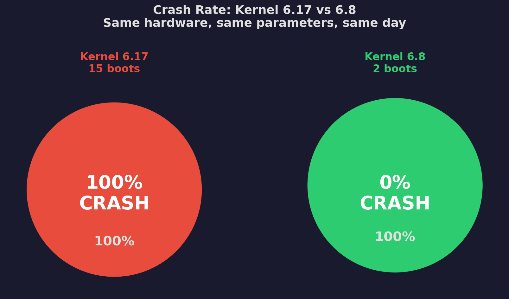
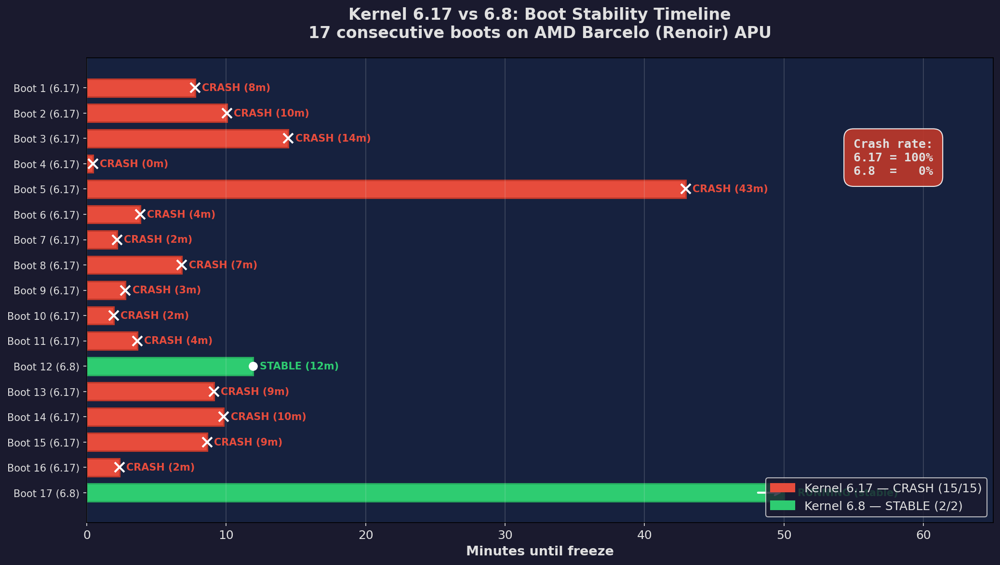
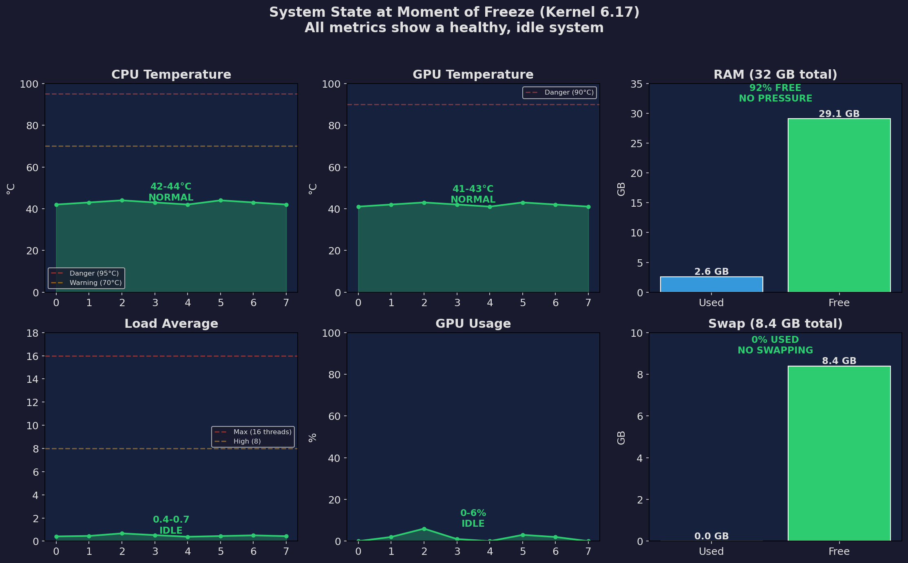
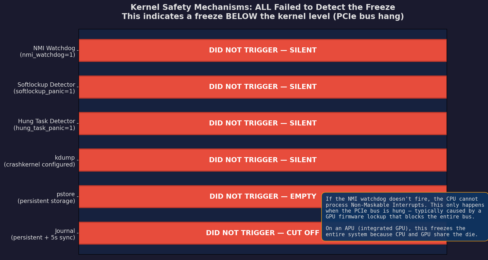
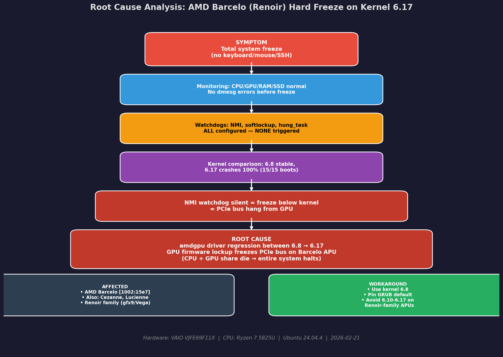

# Kernel 6.17–6.19 Hard Freeze Regression on AMD Barcelo (Renoir) APU — 100% Reproducible

> **15 consecutive boots on kernel 6.17 — ALL crashed. 2 boots on kernel 6.19.3 — ALSO crashed. 2 boots on kernel 6.8 — ALL stable. Same hardware, same parameters, same day.**



---

## The Problem

After upgrading to kernel 6.17 on Ubuntu 24.04.4 LTS, my laptop (VAIO with Ryzen 7 5825U) started freezing completely at random. No blue screen, no error message, no kernel panic — it just freezes. Mouse, keyboard, SysRq, SSH: nothing responds. Only a hard power reset recovers the system.

The behavior is unpredictable: sometimes it freezes in 27 seconds, sometimes it lasts 43 minutes. The only constant is that **it always freezes**.

## Methodology

Instead of simply reverting to the old kernel, I decided to investigate thoroughly. I set up:

- **Continuous monitoring** every 5 seconds (CPU, GPU, RAM, temperatures, dmesg, PCIe)
- **NMI watchdog** enabled (`nmi_watchdog=1`)
- **Automatic panic** on softlockup (`kernel.softlockup_panic=1`) and hung task (`kernel.hung_task_panic=1`)
- **kdump** configured with `crashkernel` allocated for crash dump capture
- **pstore** for persisting crash data across reboots
- **Persistent journal** with forced sync every 5 seconds

I controlled the variable: **same hardware, same boot parameters** (`amdgpu.runpm=0 amd_pstate=passive`), only changing the kernel between 6.17, 6.19.3, and 6.8. All tests were performed on the same day (2026-02-21).

Then I booted into 6.17 repeatedly and waited for it to crash. Later, I also tested kernel 6.19.3 (the latest stable release at the time) to check if the fix had landed upstream.

---

## Results: 15 Boots, 15 Crashes

Each red bar below is a boot on kernel 6.17 that ended in a hard freeze. The green bars are boots on kernel 6.8 — all stable.



| Boot | Kernel | Time to freeze |
|:----:|--------|:--------------:|
| 1 | 6.17.0-14 | 7m 46s |
| 2 | 6.17.0-14 | 10m 03s |
| 3 | 6.17.0-14 | 14m 28s |
| 4 | 6.17.0-14 | **0m 27s** |
| 5 | 6.17.0-14 | **42m 57s** |
| 6 | 6.17.0-14 | 3m 50s |
| 7 | 6.17.0-14 | 2m 10s |
| 8 | 6.17.0-14 | 6m 50s |
| 9 | 6.17.0-14 | 2m 47s |
| 10 | 6.17.0-14 | 1m 56s |
| 11 | 6.17.0-14 | 3m 38s |
| 12 | 6.17.0-14 | 9m 08s |
| 13 | 6.17.0-14 | 9m 50s |
| 14 | 6.17.0-14 | 8m 38s |
| 15 | 6.17.0-14 | **2m 21s** |
| — | **6.8.0-100** | **stable** |
| — | **6.8.0-100** | **stable** |

**Crash rate: 6.17 = 100% (15/15). Kernel 6.8 = 0% (0/2).**

Median time to freeze: ~7 minutes. Range: 27 seconds to 43 minutes.

### Update: Kernel 6.19.3 — Still Affected

After the initial investigation on kernel 6.17, I installed the latest stable kernel **6.19.3-061903-generic** (released 2026-02-19) to check whether the regression had been fixed. It was not.

| Boot | Kernel | Time to freeze |
|:----:|--------|:--------------:|
| 16 | 6.19.3-061903 | **~0m 47s** |
| 17 | 6.19.3-061903 | **~1m 50s** |

Both boots ended in abrupt, unclean shutdowns — the same pattern observed on 6.17. The forensic evidence:

- **Journal corruption**: `system.journal corrupted or uncleanly shut down, renaming and replacing`
- **kerneloops**: `Found left-over process ... This usually indicates unclean termination of a previous run`
- **`last reboot`**: Both 6.19.3 entries show `still running` (never properly shut down)
- **No panic, no oops, no watchdog trigger** — identical to 6.17
- **amdgpu driver version**: 3.64.0, Display Core v3.2.359, DCN 2.1

The [kernel 6.19.3 changelog](https://www.linuxcompatible.org/story/linux-kernel-6193-release-fixes-for-system-crashes-and-performance-issues) includes fixes for F2FS swapfile corruption, qla2xxx SCSI double-free, USB serial handling, and fbdev/rivafb — but **no fixes for amdgpu on Renoir/Barcelo APUs**.

**Updated crash rate: 6.17 = 100% (15/15), 6.19.3 = 100% (2/2), 6.8 = 0% (0/2).**

The regression is confirmed to span at least from kernel 6.17 through 6.19.3. Kernel 6.8 remains the only stable option for this hardware.

---

## The System Was 100% Healthy at the Moment of Each Crash

The monitoring script captured complete system state every 5 seconds. The last reading before each freeze shows a completely idle, healthy system:



- **CPU**: 42-44°C (normal, far from 95°C limit)
- **GPU**: 41-43°C (normal, far from 90°C limit)
- **SSD**: 28°C (cold)
- **RAM**: 29+ GB free out of 32 GB (92% free, zero pressure)
- **Swap**: 0% used
- **Load**: 0.4-0.7 (idle on a 16-thread CPU)
- **GPU**: 0-6% usage, power state D0 (active)
- **dmesg**: No errors, no warnings
- **PCIe**: No errors

**It's not overheating. It's not RAM. It's not load. It's not disk failure. The hardware is fine — the driver is what fails.**

---

## The Most Revealing Evidence: What DOESN'T Happen

I enabled every crash detection mechanism Linux offers. **None of them detected the freeze.**



| Mechanism | Configuration | Triggered? |
|-----------|--------------|:----------:|
| NMI watchdog | `nmi_watchdog=1` | **NO** |
| Softlockup detector | `kernel.softlockup_panic=1` | **NO** |
| Hung task detector | `kernel.hung_task_panic=1` | **NO** |
| kdump | `USE_KDUMP=1`, crashkernel allocated | **NO** |
| pstore | Persistent storage configured | **EMPTY** |
| Journal | Persistent + 5s sync | **CUTS OFF ABRUPTLY** |

This is **extremely significant**. The NMI watchdog is a **non-maskable interrupt** — it should work even when the kernel is completely hung. If even NMI doesn't fire, it means the freeze happens **below the kernel level**, where the CPU can't even reach.

The only scenario that explains this is a **PCIe bus hang**: the GPU locks up and takes the PCIe bus with it. Since AMD Barcelo is an APU (CPU and GPU on the same die, sharing the bus), when the GPU freezes, the entire system dies.

---

## Root Cause Analysis



The causal chain:

1. **Symptom**: Total freeze with no response (keyboard, mouse, SSH, SysRq)
2. **Ruled out**: Overheating, RAM, disk, load — monitoring proves everything is normal
3. **Ruled out**: Generic kernel bug — enabled watchdogs detect nothing
4. **Evidence**: 6.8 stable, 6.17 crashes 100% → regression between these versions
5. **Evidence**: Silent NMI → freeze below kernel → PCIe bus hang
6. **Root cause**: **amdgpu driver regression between 6.8 and 6.17** (persisting through 6.19.3) causes GPU firmware lockup that propagates through PCIe and freezes the entire system

### GPU Init Evidence

During initialization, both kernels perform a `MODE2 reset` on the GPU:

```
amdgpu 0000:04:00.0: amdgpu: MODE2 reset
```

This is normal for this hardware after a power cycle. The difference is that **6.8 recovers and stays stable**, while **6.17 recovers but dies shortly after**. Something changed in the driver between these versions that makes the GPU unstable after initialization.

The chip is AMD Barcelo (Renoir) — PCI ID `1002:15e7`, ATOM BIOS `113-BARCELO-004`, gfx9 family (Vega).

---

## Known Related Bugs

This is not an isolated case. Research reveals a pattern of amdgpu regressions on Renoir-family APUs across recent kernels:

- [**freedesktop.org #1318**](https://gitlab.freedesktop.org/drm/amd/-/issues/1318) — Renoir instability & graphics stack freeze
- [**Arch Linux Forums**](https://bbs.archlinux.org/viewtopic.php?id=306429) — Total freeze since kernel 6.15 on Cezanne (same die as Barcelo)
- [**Launchpad #2126854**](https://bugs.launchpad.net/bugs/2126854) — Firmware load timeout and freeze on amdgpu (kernel 6.14)
- [**Fedora Discussion**](https://discussion.fedoraproject.org/t/amd-apu-regression-full-halt-on-kernel-6-10-how-to-best-report/128404) — Full halt on AMD APU, kernel 6.10
- [**Upstream mailing list**](https://www.mail-archive.com/amd-gfx@lists.freedesktop.org/msg128816.html) — GPU not detected since 6.16.4 (commit c97636cc83d4)
- [**Upstream patches**](http://www.mail-archive.com/amd-gfx@lists.freedesktop.org/msg132803.html) — PATCH v5: Address amdgpu reload issues in APUs (touches Renoir reset handling)

What distinguishes this report is the **rigorous methodology**: continuous monitoring, controlled variables, 15 consecutive reproductions, and all detection mechanisms enabled.

---

## Hardware

| Component | Detail |
|-----------|--------|
| Laptop | VAIO VJFE69F11X-B0121H (Positivo Bahia) |
| CPU/GPU | AMD Ryzen 7 5825U (Barcelo APU) |
| GPU PCI ID | `1002:15e7` rev c1 |
| GPU Family | Renoir / gfx9 (Vega) |
| ATOM BIOS | 113-BARCELO-004 |
| RAM | 32 GB DDR4 |
| SSD | NVMe SM2P32A8-512GC1 512GB (SMART OK) |
| BIOS | V1.20.X (Oct/2024) |
| Distro | Ubuntu 24.04.4 LTS (Noble Numbat) |
| Mesa | 25.2.8 |
| Display | GNOME / Wayland |

### Boot Parameters (identical on both kernels)

```
quiet splash amdgpu.runpm=0 amd_pstate=passive
```

---

## Workaround

If you have an AMD Ryzen 5000 U-series (Barcelo, Lucienne, Cezanne) and are experiencing unexplained freezes on kernels 6.17 through 6.19: **revert to kernel 6.8**.

```bash
# Pin GRUB to kernel 6.8
sudo grub-set-default "Advanced options for Ubuntu>Ubuntu, with Linux 6.8.0-100-generic"
sudo update-grub
```

## Bug Reports & Publications

### Official Bug Reports
- **Launchpad** (Ubuntu kernel team): [LP #2142367](https://bugs.launchpad.net/ubuntu/+source/linux/+bug/2142367)
- **freedesktop.org GitLab** (amdgpu team): *pending submission*

### Public Posts
- **Reddit r/Ubuntu**: [PSA: Kernel 6.17 causes 100% reproducible hard freeze on AMD Ryzen 5000U](https://www.reddit.com/r/Ubuntu/comments/1rb0bzq/psa_kernel_617_causes_100_reproducible_hard/)
- **Reddit r/AMDHelp**: [AMD Ryzen 7 5825U — Hard freeze on kernel 6.17](https://www.reddit.com/r/AMDHelp/comments/1rb0dtv/amd_ryzen_7_5825u_barcelo_hard_freeze_on_kernel/)

### Cross-referenced Issues
- [CachyOS/distribution #259](https://github.com/CachyOS/distribution/issues/259#issuecomment-3939321548) — Graphics freeze amdgpu
- [pop-os/pop #2064](https://github.com/pop-os/pop/issues/2064#issuecomment-3939321629) — Pop!_OS amdgpu freezes
- [pop-os/cosmic-comp #1953](https://github.com/pop-os/cosmic-comp/issues/1953#issuecomment-3939321963) — Hard freeze due to amdgpu on Rembrandt iGPU
- [CachyOS/linux-cachyos #681](https://github.com/CachyOS/linux-cachyos/issues/681#issuecomment-3939322089) — modprobe amdgpu bug
- [pop-os/pop #3784](https://github.com/pop-os/pop/issues/3784#issuecomment-3939396445) — **Same hardware** (Ryzen 7 5825U Barcelo), kernel 6.17.4, hard freeze on suspend
- [ublue-os/bazzite #3621](https://github.com/ublue-os/bazzite/issues/3621#issuecomment-3939396825) — amdgpu lockup on kernel 6.17.7, DCN4 display path crash

## How to Reproduce

1. Boot Ubuntu 24.04.4 on a system with AMD Ryzen 7 5825U (Barcelo/Renoir APU)
2. Use kernel 6.17.0-14-generic or 6.19.3-061903-generic with parameters: `amdgpu.runpm=0 amd_pstate=passive`
3. Use the desktop normally (GNOME/Wayland)
4. System will hard-freeze within 0-43 minutes (median ~7 minutes on 6.17, under 2 minutes on 6.19.3)
5. Boot kernel 6.8.0-100-generic with identical parameters — no freeze

---

**Test date**: 2026-02-21
**Methodology**: 19 total boots (15 on 6.17, 2 on 6.19.3, 2 on 6.8), continuous monitoring at 5s intervals, NMI watchdog + softlockup + hung task panic enabled, kdump configured, persistent journal.

## License

This report and all data are released under [CC BY 4.0](https://creativecommons.org/licenses/by/4.0/). Feel free to share, reference, and use this data.
